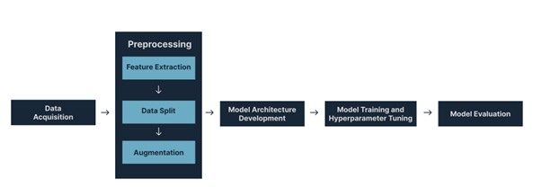
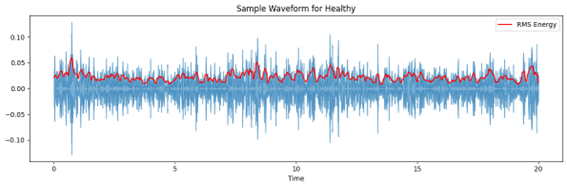
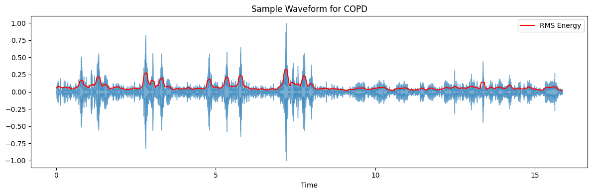
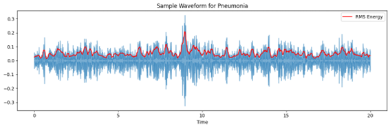
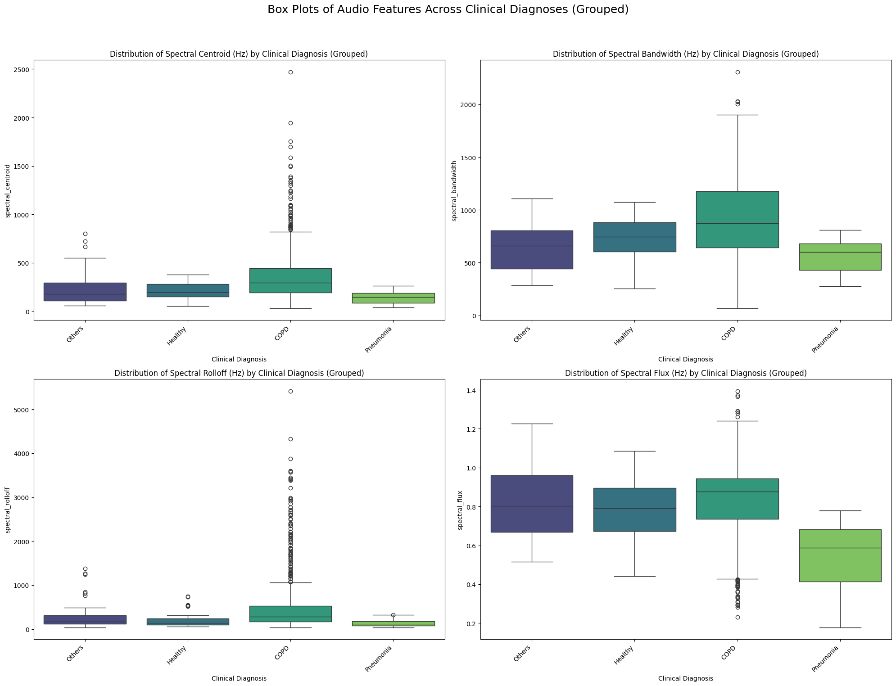
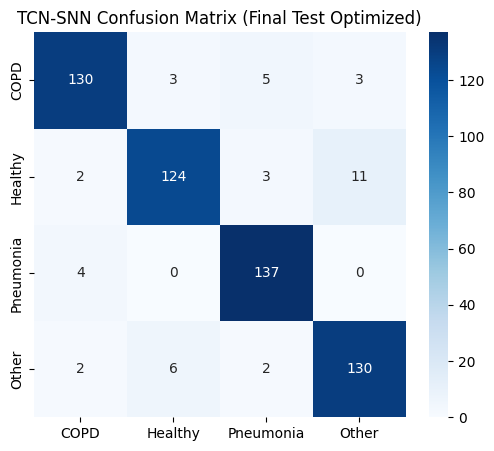
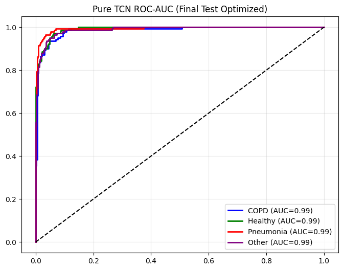
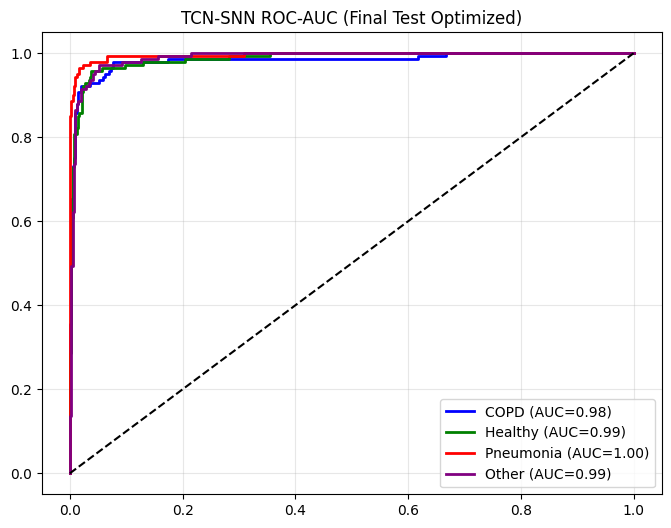

# PulmoScope — AI-Assisted Lung Sound Analysis  


### Live Demo: https://pulmoscope.streamlit.app/
## Full Manuscript
Access the complete research manuscript here:  
https://tinyurl.com/pulmoscope

PulmoScope is a **deep-learning powered assistive tool** developed to analyze **lung auscultation sounds** and classify respiratory conditions including Healthy, COPD, Pneumonia, and Other abnormalities. It implements two temporal AI architectures:

- Pure Temporal Convolutional Network (TCN)
- Hybrid Temporal Convolutional Network with Spiking Neural Network (TCN-SNN)

Disclaimer: PulmoScope is not a medical device. It is intended solely for academic research and demonstration.

---

## 1. Project Overview

PulmoScope provides:

- Uploading of `.wav` lung sound recordings  
- Browser-based microphone recording  
- Automated preprocessing (filtering, segmentation, normalization)  
- Mel-spectrogram feature extraction  
- Side-by-side predictions from TCN and TCN-SNN  
- Optional Grad-CAM interpretability  
- Streamlit-based UI

The experimental process involves architecture comparison, hyperparameter tuning, and final evaluation.

---

## 2. Figures from the Research Manuscript

### 2.1 Pipeline Overview


### 2.2 Waveforms and RMS Envelopes

#### Healthy


#### COPD


#### Pneumonia


### 2.3 Spectral Feature Analysis


### 2.4 Model Performance

#### Confusion Matrix
<div style="display: flex; gap: 10px;">
  
  
</div>


#### ROC Curves
<div style="display: flex; gap: 10px;">
  
  
</div>

---

## 3. Features

### Audio Input
- Upload `.wav` files
- Record audio in-browser

### AI Models
- Pure TCN with multi-scale convolution and attention  
- Hybrid TCN–SNN with spiking neuron activation  

### Output Visualizations
- Mel-spectrogram  
- Grad-CAM heatmap  
- Class probabilities  

### Diagnostic Labels

| Label | Description |
|-------|-------------|
| Healthy | Normal respiratory sound pattern |
| COPD | Wheezes and obstructive airflow |
| Pneumonia | Crackles and fluid-related abnormalities |
| Other | Asthma, URTI/LRTI, Bronchiectasis |

---

## 4. Model Architecture

### Pure TCN
- Kernel sizes: 3, 5, 7
- Dilated convolutions
- Residual blocks
- Attention module

### Hybrid TCN–SNN
- Identical TCN backbone
- Parametric LIF spiking neuron module
- Sparse temporal activation
- Attention classifier head

### Shared Classifier
- Dense layers: 192 → 128 → 64
- GELU activation
- Dropout
- Softmax output layer

---

## 5. Repository Structure

```
PulmoScope/
├── app.py
├── assets/
│   ├── banner.png
│   └── figures/
│       ├── pipeline_overview.png
│       ├── waveform_healthy.png
│       ├── waveform_copd.png
│       ├── waveform_pneumonia.png
│       ├── spectral_boxplots.png
│       ├── confusion_matrix.png
│       └── roc_curves.png
├── models/
│   ├── pure_tcn_weights.pth
│   └── tcn_snn_weights.pth
├── utils/
│   ├── preprocess.py
│   ├── inference.py
│   ├── architectures.py
│   ├── gradcam.py
│   └── audio_utils.py
├── requirements.txt
└── README.md
```

---

## 6. Installation

### Clone the Repository
```
git clone https://github.com/LadyJo02/PulmoScope.git
cd PulmoScope
```

### Install Dependencies
```
pip install -r requirements.txt
```

### Run the Application
```
streamlit run app.py
```

---

## 7. Usage

1. Launch the Streamlit app.
2. Upload a `.wav` file or record new audio.
3. PulmoScope performs preprocessing:
   - Resampling  
   - Filtering  
   - Segmentation  
   - Mel-spectrogram extraction  
4. Both TCN and TCN-SNN generate predictions.
5. View probability outputs and optional Grad-CAM heatmaps.

---

## 8. Future Improvements

- Digital stethoscope integration  
- Mobile deployment  
- Noise-robust denoising models  
- Larger clinical dataset expansion  

---

## 9. Authors

PulmoScope was developed by:

- Genheylou Felisilda  
- Nicole Menorias  
- Kobe Marco Olaguir  
- Joanna Reyda Santos

---

## 10. License

This project is intended solely for academic research and educational purposes. It is not approved for clinical use.

This project is open source and available under the [MIT License](LICENSE).
